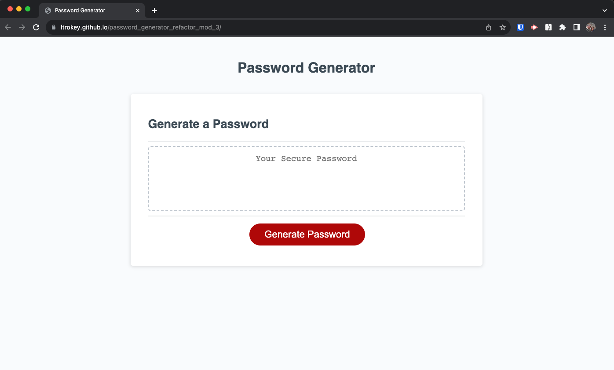
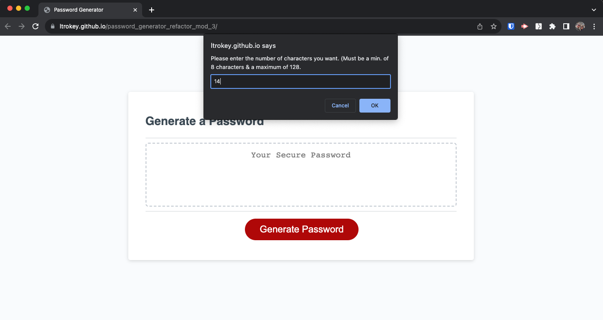
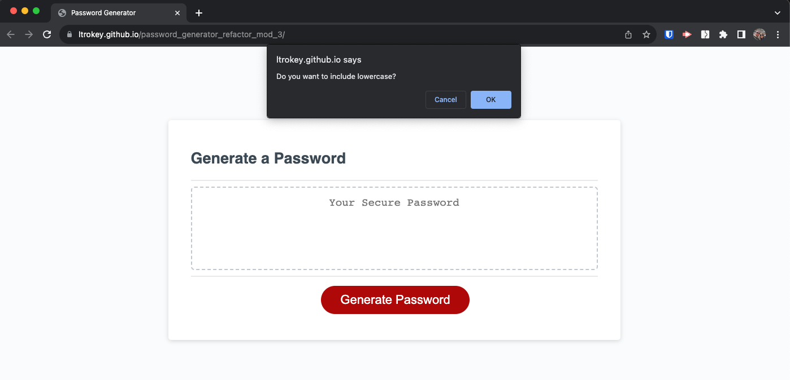
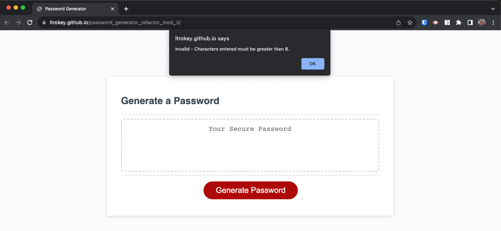
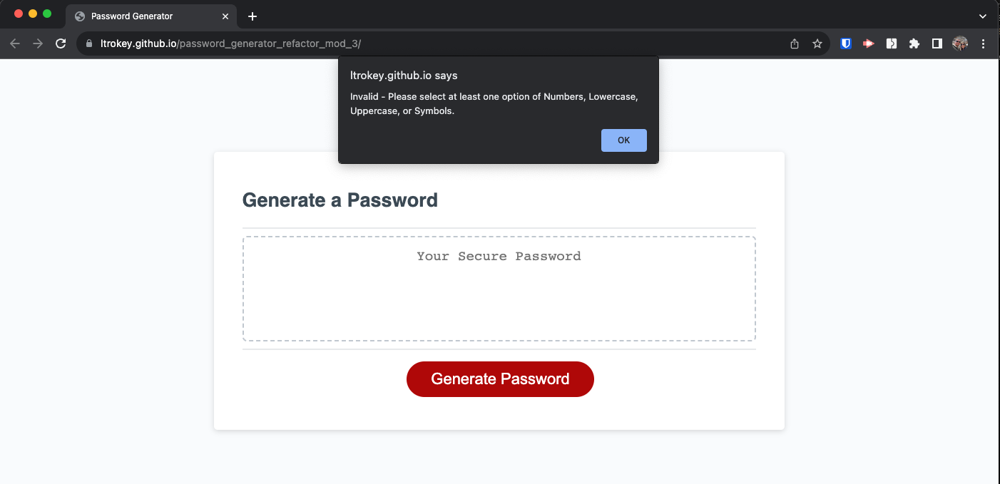

# Password Generator - JavaScript

[Link to live deploy](https://ltrokey.github.io/password_generator_refactor_mod_3/)

## Description

Provide a short description explaining the what, why, and how of your project. Use the following questions as a guide:

The JavaScript Password Generator project was driven by the goal of creating a user-friendly tool for generating strong passwords based on individual preferences. It offers customization options for lowercase, uppercase, symbols, and numbers. The project enhances user security awareness by providing reliable password generation. Future plans may include further customization features and integration with password management tools to continuously improve user online security. During the project, I learned the importance of pseudo coding and implementing control structures like loops and conditional statements.

## Installation

1. In terminal, CD into project directory.
2. Git clone password_generator_refactor_mod_3.
3. CD into new project directory.
4. Open with your text editor, for VS Code, command `code .`.

## Usage

1. `Click` the `Generate Password` button.
2. When prompted, enter the amount of characters for your password from 8 to 128.
3. When prompted, confirm if you would like numbers included by `clicking` `okay` or `cancel` to not include.
4. When prompted, confirm if you would like lowercase included by `clicking` `okay` or `cancel` to not include.
5. When prompted, confirm if you would like Uppercase included by `clicking` `okay` or `cancel` to not include.
6. When prompted, confirm if you would like symbols included by `clicking` `okay` or `cancel` to not include.
7. Password will be generated based on your selections and available in the text box.

## License

MIT License

Copyright (c) 2023 ltrokey

Permission is hereby granted, free of charge, to any person obtaining a copy
of this software and associated documentation files (the "Software"), to deal
in the Software without restriction, including without limitation the rights
to use, copy, modify, merge, publish, distribute, sublicense, and/or sell
copies of the Software, and to permit persons to whom the Software is
furnished to do so, subject to the following conditions:

The above copyright notice and this permission notice shall be included in all
copies or substantial portions of the Software.

THE SOFTWARE IS PROVIDED "AS IS", WITHOUT WARRANTY OF ANY KIND, EXPRESS OR
IMPLIED, INCLUDING BUT NOT LIMITED TO THE WARRANTIES OF MERCHANTABILITY,
FITNESS FOR A PARTICULAR PURPOSE AND NONINFRINGEMENT. IN NO EVENT SHALL THE
AUTHORS OR COPYRIGHT HOLDERS BE LIABLE FOR ANY CLAIM, DAMAGES OR OTHER
LIABILITY, WHETHER IN AN ACTION OF CONTRACT, TORT OR OTHERWISE, ARISING FROM,
OUT OF OR IN CONNECTION WITH THE SOFTWARE OR THE USE OR OTHER DEALINGS IN THE
SOFTWARE.

## Badges

## Features

I added error handling for edge cases such as a user enters too many or not enough password characters and if they don't select any options.  